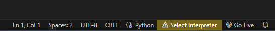

# Install your IDE

We'll use [VSCODE](https://code.visualstudio.com/download) since it's free and I like it :-)

After installing, add the python extension.

# Install Python and Pipenv

[Link to install Python 3.11](https://www.python.org/downloads/release/python-3110/)

click yes on Add to Path

After installation, reboot and type `python -V` in powershell.

Open vscode and select python 3.11 as the interpreter.

# Install Pipenv

To work in clean environment with only the libraries we need, it is good practice to start a virtual environment for each new project. We will use pipenv but other options exist as well (virtualenv, conda...)

Most versions of python will include pip by default. It allows us to install libraries as needed.

In vscode, open a terminal and run `pip install pipenv`.

## Create your virtual environment

In the same terminal, run `pipenv install`

Once it's done, change your interpreter in VSCODE to the newly created one.

